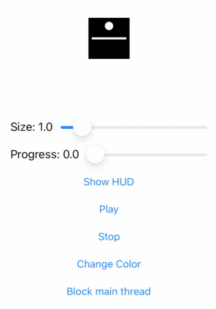

```
                ██╗███╗   ██╗██╗  ██╗ ██████╗ ███╗   ██╗ ██████╗ ████████╗███████╗                
                ██║████╗  ██║██║ ██╔╝██╔═══██╗████╗  ██║██╔═══██╗╚══██╔══╝██╔════╝
                ██║██╔██╗ ██║█████╔╝ ██║   ██║██╔██╗ ██║██║   ██║   ██║   █████╗  
                ██║██║╚██╗██║██╔═██╗ ██║   ██║██║╚██╗██║██║   ██║   ██║   ██╔══╝  
                ██║██║ ╚████║██║  ██╗╚██████╔╝██║ ╚████║╚██████╔╝   ██║   ███████╗
                ╚═╝╚═╝  ╚═══╝╚═╝  ╚═╝ ╚═════╝ ╚═╝  ╚═══╝ ╚═════╝    ╚═╝   ╚══════╝
```
<!--- ANSI Shadow -->

---

# DimoLogo

<!-- [](https://travis-ci.org/ty0x2333/DimoLogo) -->
[](https://codebeat.co/a/inkonote/projects/github-com-inkonote-dimologo-master)
[](https://cocoapods.org/pods/DimoLogo)
[](https://cocoapods.org/pods/DimoLogo)
[](https://cocoapods.org/pods/DimoLogo)



## Example

To run the example project, clone the repo, and run `pod install` from the Example directory first.

## Requirements

## Installation

DimoLogo is available through [CocoaPods](https://cocoapods.org). To install
it, simply add the following line to your Podfile:

```ruby
pod 'DimoLogo'
```

## Author

ty0x2333, ty0x2333@gmail.com

## License

DimoLogo is available under the MIT license. See the LICENSE file for more info.
